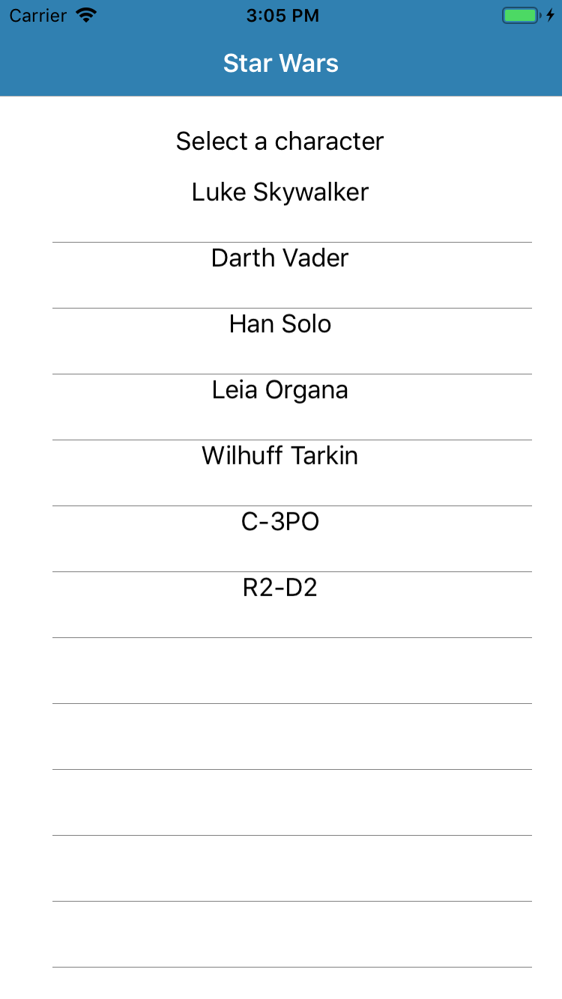
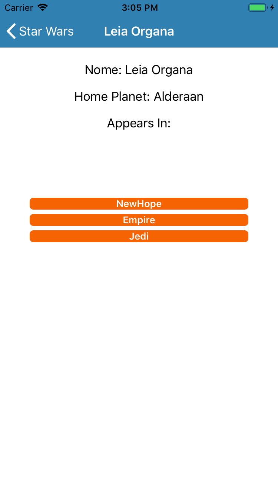

> This is a sample with the library FSharp.Data.GraphQL.Client + Fabulous on Xamarin

| Main Page | Details Page |
| --------- | ----------- |
|  |  |

### Dependencies
- dotnet Core SDK `>= 2.2.300`
- Xamarin _// this project was only tested on VS for Mac_
- [Fabulous](https://fsprojects.github.io/Fabulous/)
- FSharp.Data.GraphQL.Client

### Running API
The API used on this project can be found is the sample of API in the folder [star-wars-api](https://github.com/luizperes/FSharp.Data.GraphQL/tree/dev/samples/star-wars-api). You start the API by running:
```
> dotnet run
```

### Running the GraphQL type provider on Xamarin

- `open project on Visual Studio or Visual Studio for Mac`
- restore Nuget packages
- Select platform (Android or iOS)
- Run project through the tool

_Obs.: this project will only work if the API is running on port 8084, so if you setup a different port, you will have to modify files AppDelegate.fs, MainActivity.fs and Common.fs_

### Example of Usage


